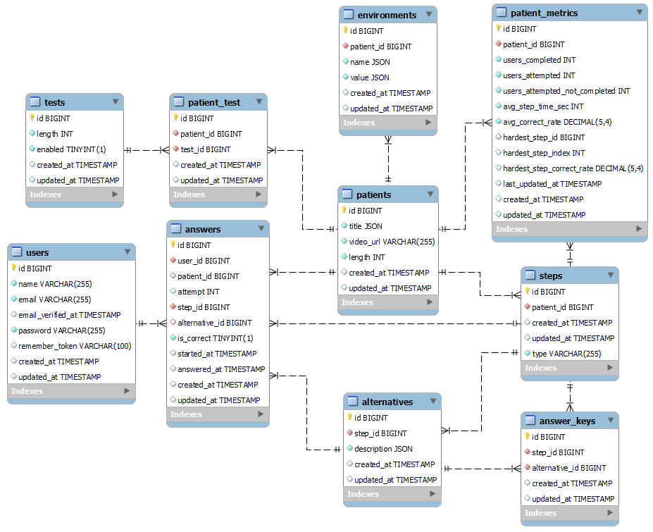

# 🏥 Surviving the Shift - API

RESTful API built with Laravel 12 for simulating clinical cases in a hospital environment. Provides endpoints for authentication, patient management, answers, and performance reports.

## 🛠 Tech Stack

-   **Laravel 12.0** - PHP Framework
-   **PHP 8.2+** - Programming language
-   **MySQL 8.0** - Database
-   **Laravel Sanctum 4.0** - Token-based authentication
-   **Laravel Sail 1.41** - Docker environment for development

### Requirements

-   PHP ^8.2
-   Composer
-   Docker & Docker Compose (for Laravel Sail)

## 🏗 Architecture

### Project Structure

```
app/
├── Helpers/           # Helper classes (TranslationHelper)
├── Http/Controllers/  # API Controllers
├── Models/            # Eloquent Models
└── Services/          # Business logic

routes/
└── api.php           # API routes

database/
├── migrations/       # Database migrations
└── seeders/          # Database seeders
```

### Architecture Pattern

-   **MVC Pattern** - Separation of concerns
-   **Service Layer** - Business logic isolated in Services
-   **Dependency Injection** - Dependency injection via constructors

### Data Flow

```
Request → Route → Controller → Service → Model → Database
  ↑                                                ↓
  └─────────────── JSON Response ─────────────────┘
```

### Main Components

**Controllers:** AuthController, PatientController, StepController, AnswerController, DashboardController, PersonalReportController

**Services:** AnswerService, DashboardService, PersonalReportService

**Models:** User, Patient, Step, Alternative, Answer, AnswerKey, Environment, Test, PatientMetric

## 💾 Database

### Schema



### Main Entities

-   **users** - System users
-   **patients** - Clinical cases/patients
-   **steps** - Steps of each clinical case
-   **alternatives** - Answer alternatives
-   **answers** - User answers
-   **answer_keys** - Correct answer keys

## 🚀 Getting Started

### 1. Install dependencies

```bash
cd api
composer install
```

### 2. Configure environment

```bash
cp .env.example .env
php artisan key:generate
```

Edit the `.env` file with your database configurations.

### 3. Run with Laravel Sail (Recommended)

```bash
# Start Docker containers
./vendor/bin/sail up -d

# Run migrations and seed database
./vendor/bin/sail artisan migrate:fresh --seed
```

The API will be available at `http://localhost`

### 4. Run without Docker

```bash
# Configure MySQL in .env and run
php artisan migrate:fresh --seed
php artisan serve
```

The API will be available at `http://localhost:8000`

### Useful Commands

```bash
# Full development environment (server, queue, logs, vite)
composer dev

# Run tests
composer test

# Format code
./vendor/bin/sail pint
```

---
